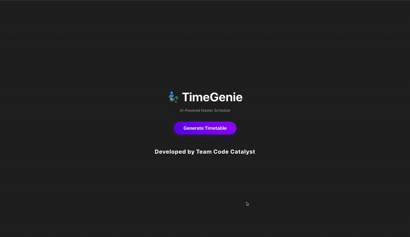

TimeGenie: AI Timetable Optimizer (Smart India Hackathon Project)

TimeGenie is an AI-powered timetable optimization system built for Smart India Hackathon (SIH). It automates the generation of conflict-free academic timetables by modeling complex constraints such as faculty availability, room capacity, NEP-2020 credit structures, electives, and program-wise scheduling rules. The system uses an intelligent fitness-function–based optimization algorithm to solve this NP-hard problem and is supported by a Django REST API backend with a scalable architecture, allowing dynamic updates, admin control, and exportable timetable outputs.